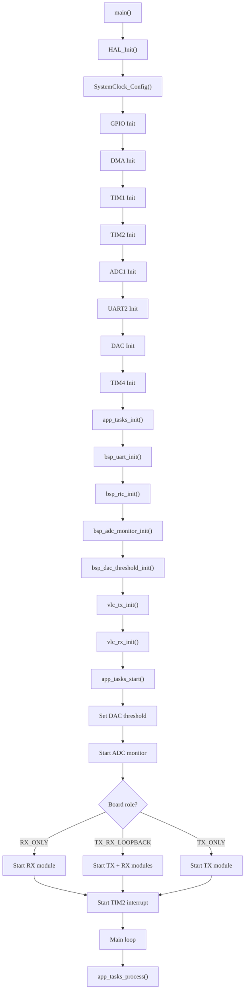
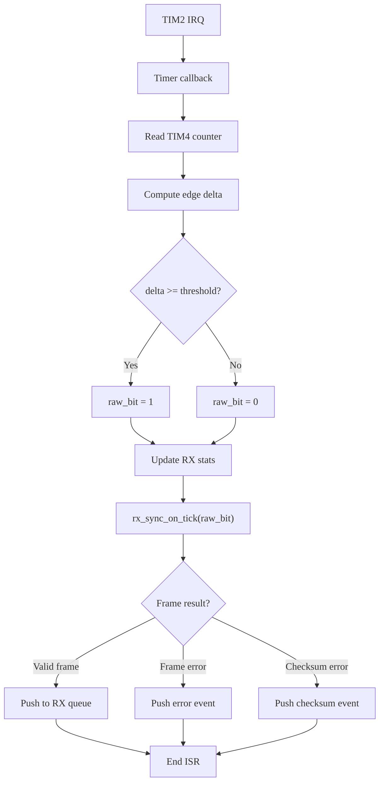
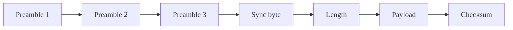
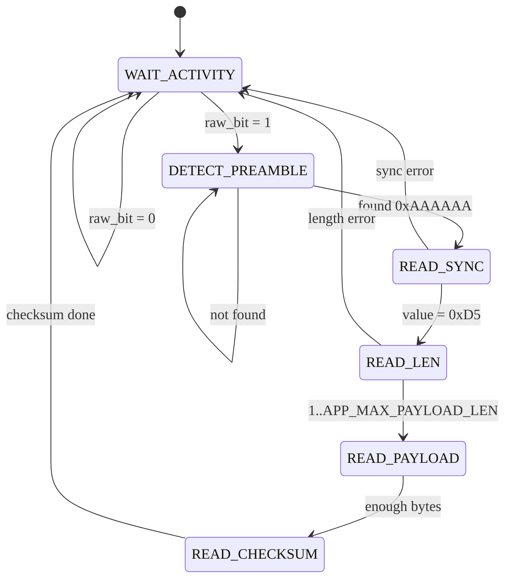
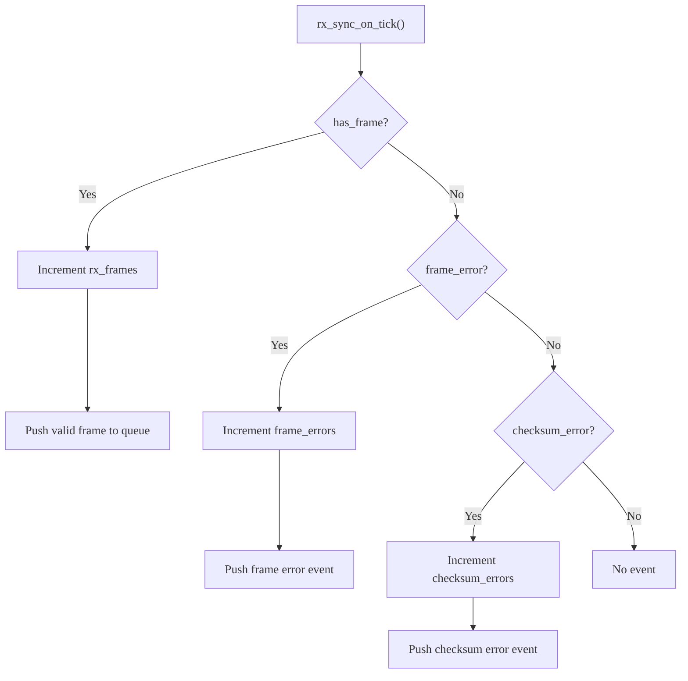
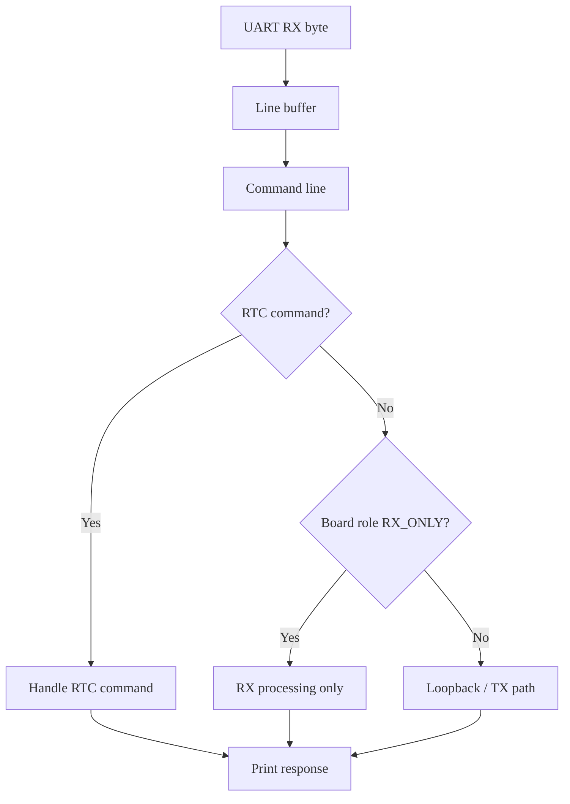
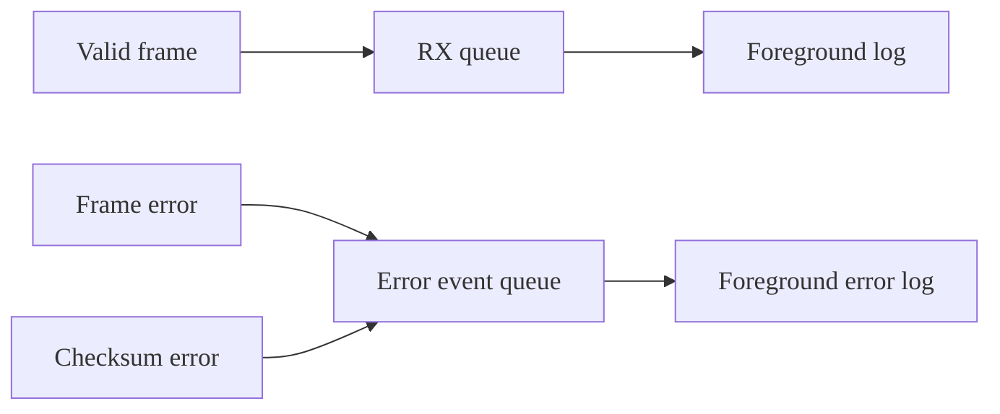

# RX Flow - OWC Project

Tài liệu này mô tả luồng xử lý RX của firmware truyền thông quang OWC trên STM32F407. Nội dung tập trung vào chế độ `APP_BOARD_ROLE_RX_ONLY`, đồng thời vẫn nêu rõ phần dùng chung với chế độ loopback để tiện cho report kỹ thuật và debug hệ thống.

---

## 1. Tổng quan

Luồng RX trong firmware được chia thành các phần chính:

1. Khởi tạo hệ thống, bật các ngoại vi hỗ trợ thu và giám sát.
2. Đọc xung cạnh từ `TIM4` trên chân `PB6`.
3. Mỗi nhịp `TIM2`, chuyển số cạnh đo được thành `raw_bit`.
4. Đưa `raw_bit` vào máy trạng thái `rx_sync`.
5. Nếu frame hợp lệ, đẩy vào queue để xử lý ở foreground.
6. Nếu lỗi sync hoặc checksum, tạo error event để log sau trong main loop.

Các ràng buộc kỹ thuật chính của khối RX:

* `TIM4` dùng edge-count để đếm cạnh từ tín hiệu thu.
* `APP_RX_EDGE_THRESHOLD = 6` dùng để chuyển delta cạnh thành bit 0/1.
* `TIM2` vẫn là bit tick 100 kHz.
* RX không in UART trong ISR.
* Các frame hợp lệ và frame lỗi đều được đưa ra foreground loop để log, tránh làm nặng ngắt.

---

## 2. Các khối chính trong luồng RX

| Khối                  | Vai trò |
| --------------------- | ------- |
| `main.c`              | Khởi tạo hệ thống và chạy vòng lặp chính |
| `app_tasks.c/h`       | Điều phối init, start, ISR theo board role, xử lý log UART |
| `vlc_rx.c/h`          | Đọc TIM4, tạo raw bit, quản lý queue frame và error event |
| `rx_sync.c/h`         | FSM đồng bộ preamble, sync, length, payload, checksum |
| `app_protocol.c/h`    | Cung cấp payload/frame chuẩn để so sánh |
| `vlc_tx.c/h`          | Cung cấp frame TX snapshot cho log so sánh và thống kê |
| `bsp_uart.c/h`        | In log và nhận command UART |
| `bsp_adc_monitor.c/h` | Giám sát điện áp hệ thống |
| `bsp_dac_threshold.c/h` | Theo dõi ngưỡng DAC |
| `bsp_rtc.c/h`         | Cung cấp timestamp cho log |

Trong chế độ `APP_BOARD_ROLE_RX_ONLY`, khối RX là thành phần trung tâm. Firmware vẫn giữ các khối hỗ trợ như ADC, DAC và RTC để phục vụ giám sát hệ thống và đồng bộ log.

---

## 3. Luồng khởi động RX

Khi firmware bắt đầu chạy, `main.c` thực hiện các bước khởi tạo HAL, clock hệ thống, GPIO và các ngoại vi cần thiết. Sau đó, `app_tasks_init()` khởi tạo các module ứng dụng, bao gồm UART, RTC, ADC monitor, DAC threshold, TX và RX. Tiếp theo, `app_tasks_start()` bật các runtime module theo `APP_BOARD_ROLE`.



**Hình x. Luồng khởi động firmware khi chạy theo nhánh RX.**

Trong chế độ RX, `vlc_rx_init(htim4)` thiết lập queue frame, queue error event và reset trạng thái FSM. `vlc_rx_start()` sau đó khởi động `TIM4` ở chế độ edge-count để đo số cạnh của tín hiệu quang thu được.

---

## 4. Luồng thu bit RX

Mỗi lần `TIM2` phát sinh ngắt, firmware gọi callback timer. Trong chế độ `APP_BOARD_ROLE_RX_ONLY`, ISR chỉ gọi `vlc_rx_on_bit_tick()` để lấy mẫu cửa sổ bit hiện tại từ `TIM4`.



**Hình x. Lưu đồ xử lý bit RX trong mỗi chu kỳ ngắt TIM2.**

Ở mỗi nhịp, firmware đọc giá trị counter của `TIM4`, tính chênh lệch so với lần đọc trước, rồi so sánh với `APP_RX_EDGE_THRESHOLD = 6`. Nếu số cạnh đủ lớn, bit được suy ra là `1`, ngược lại là `0`. Cách làm này giúp RX không cần lấy mẫu biên độ analog trực tiếp, mà dựa vào số cạnh thu được từ đường quang.

---

## 5. Cấu trúc frame RX

RX giải mã frame theo cùng định dạng với TX:

```text
AA AA AA | D5 | LEN | PAYLOAD | CHECKSUM
```

Trong đó:

| Trường     | Ý nghĩa |
| ---------- | ------- |
| `AA AA AA` | Preamble để phát hiện khung bắt đầu |
| `D5`       | Sync byte |
| `LEN`      | Độ dài payload |
| `PAYLOAD`  | Dữ liệu cần nhận |
| `CHECKSUM` | Byte kiểm tra lỗi |



**Hình x. Cấu trúc frame thu được bởi khối RX.**

RX dùng cùng công thức checksum với TX:

```text
CHECKSUM = (LEN + sum(PAYLOAD)) mod 256
```

Với payload mặc định `55 A5 3C C3`, frame hợp lệ sẽ có checksum `FD`.

---

## 6. Máy trạng thái đồng bộ RX

Khối `rx_sync` là trung tâm của luồng RX. Nó nhận `raw_bit` từ `vlc_rx_on_bit_tick()` và giải mã dần thành byte, rồi thành frame.

Các trạng thái chính:

| State | Ý nghĩa |
| ----- | ------- |
| `RX_SYNC_WAIT_ACTIVITY` | Chờ có hoạt động trên đường RX |
| `RX_SYNC_DETECT_PREAMBLE` | Tìm chuỗi `AA AA AA` bằng shift 24-bit |
| `RX_SYNC_LOCK_BIT_TIMING` | Trạng thái khóa bit timing trung gian |
| `RX_SYNC_READ_SYNC` | Đọc byte sync `D5` |
| `RX_SYNC_READ_LEN` | Đọc độ dài payload |
| `RX_SYNC_READ_PAYLOAD` | Đọc các byte payload |
| `RX_SYNC_READ_CHECKSUM` | Đọc byte checksum và kiểm tra |



**Hình x. FSM đồng bộ và giải mã frame RX.**

Hai điểm quan trọng trong FSM:

1. `WAIT_ACTIVITY` không làm mất bit `1` đầu tiên khi bắt đầu preamble.
2. Sau khi phát hiện `AA AA AA`, FSM chuyển sang `READ_SYNC` mà không bỏ mất bit kế tiếp.

Khi `READ_CHECKSUM` nhận đủ byte cuối:

* Nếu checksum đúng, `result.has_frame = 1`.
* Nếu sai checksum, `result.checksum_error = 1`.
* Nếu sai sync hoặc sai length, `result.frame_error = 1`.

---

## 7. Luồng xử lý frame hợp lệ và lỗi



**Hình x. Xử lý kết quả sau khi FSM giải mã một bit window.**

Khi một frame hợp lệ xuất hiện, `vlc_rx.c` đẩy frame vào queue valid frame và gán `rx_frame_id` theo bộ đếm quan sát riêng `s_rx_observed_frames`. Nếu là lỗi, firmware không in UART ngay trong ISR mà đẩy error event sang queue riêng để xử lý ở foreground loop.

---

## 8. Luồng UART điều khiển và log RX

UART command được xử lý trong foreground loop tại `app_tasks_process()`. Firmware không xử lý UART trong ISR để tránh blocking và để giữ `TIM2` ngắn.



**Hình x. Luồng xử lý UART command trong foreground loop.**

Các log chính của RX gồm:

```text
role board_role=RX_ONLY
alive_rx rx_frames=<N> frame_errors=<N> checksum_errors=<N> rx_sync_state=<N> last_edge_delta=<N> last_raw_bit=<N>
expected_tx_frame len=<N> payload=<HEX...> checksum=<XX> frame=<HEX...>
last_rx len=<N> payload=<HEX...>
rx_frame rx_frame_id=<N> len=<N> payload=<HEX...> checksum=<XX> frame=<HEX...>
link_stats payload_bits=<N> payload_bit_errors=<N> payload_ber_ppm=<N> invalid_frames=<N> payload_mismatch_frames=<N> good_payload_frames=<N>
link_quality rx_total_observed=<N> per_ppm=<N>
err_summary queued=<N> printed=<N> suppressed=<N>
err_frame ...
err_bits ...
adc_mv ...
dac_mv threshold=1650
rtc ...
```

Log `expected_tx_frame` rất quan trọng trong chế độ RX_ONLY vì board RX không phát dữ liệu thật, nhưng vẫn cần biết frame chuẩn để so sánh và tính thống kê chất lượng liên kết.

---

## 9. Queue frame và error event

RX dùng hai queue riêng:

1. Queue frame hợp lệ: chứa các frame decode thành công.
2. Queue error event: chứa event lỗi để log ở foreground loop.



**Hình x. Cơ chế queue trong khối RX.**

Thiết kế này giúp ISR ngắn, giảm nguy cơ nghẽn UART và tránh in log nặng ngay trong ngắt `TIM2`.

---

## 10. Thống kê chất lượng link

Đối với frame hợp lệ, firmware so sánh payload nhận được với payload chuẩn từ `app_protocol`. Từ đó, hệ thống cập nhật:

* `payload_bits`
* `payload_bit_errors`
* `invalid_frames`
* `payload_mismatch_frames`
* `good_payload_frames`

Sau đó, firmware in ra:

```text
link_stats payload_bits=<N> payload_bit_errors=<N> payload_ber_ppm=<N> invalid_frames=<N> payload_mismatch_frames=<N> good_payload_frames=<N>
```

Và:

```text
link_quality rx_total_observed=<N> per_ppm=<N>
```

Chỉ số này giúp GUI và người dùng đánh giá chất lượng đường truyền mà không cần phân tích từng frame thủ công.

---

## 11. Tiêu chí kiểm thử RX_ONLY

Khi kiểm thử chế độ `APP_BOARD_ROLE_RX_ONLY`, cần quan sát:

1. `rx_frames` tăng đều khi board RX nhận được tín hiệu từ board TX.
2. `last_rx` hiển thị đúng payload mặc định hoặc payload vừa được phát.
3. `expected_tx_frame` luôn đúng frame chuẩn để so sánh.
4. `frame_errors` và `checksum_errors` thấp hoặc bằng 0 khi tín hiệu ổn định.
5. `rx_sync_state`, `last_edge_delta`, `last_raw_bit` thay đổi hợp lý theo đường tín hiệu.
6. Không có UART logging bên trong ISR.

```text
expected_tx_frame len=4 payload=55 A5 3C C3 checksum=FD frame=AA AA AA D5 04 55 A5 3C C3 FD
last_rx len=4 payload=55 A5 3C C3
```

---

## 12. Kết luận

Luồng RX của OWC Project được thiết kế theo hướng tách rõ ba tầng: đo cạnh ở `TIM4`, chuyển đổi thành bit ở `TIM2`, và giải mã frame bằng FSM `rx_sync`. Cách chia này giúp firmware giữ ISR ngắn, dễ debug và vẫn đảm bảo tính ổn định cho hệ thống OOK. Các frame hợp lệ và các lỗi giải mã đều được đưa sang foreground loop để log, nhờ đó UART không làm ảnh hưởng tới realtime của đường thu.

Thiết kế này đáp ứng tốt các yêu cầu của hệ thống truyền thông quang: decode frame theo đúng cấu trúc `AA AA AA | D5 | LEN | PAYLOAD | CHECKSUM`, hỗ trợ thống kê chất lượng link, và giữ khả năng mở rộng cho GUI cũng như các chế độ board role khác.
