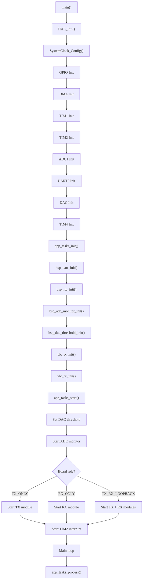
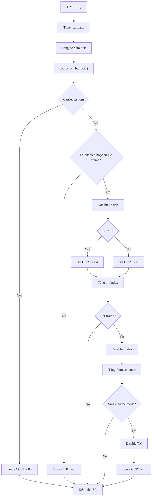
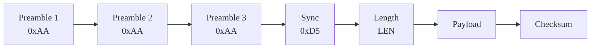
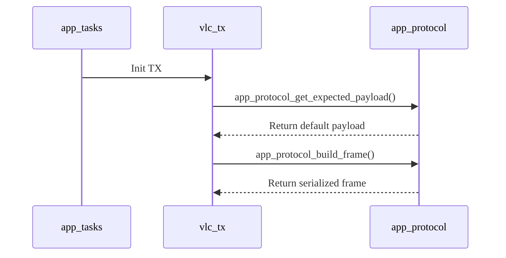
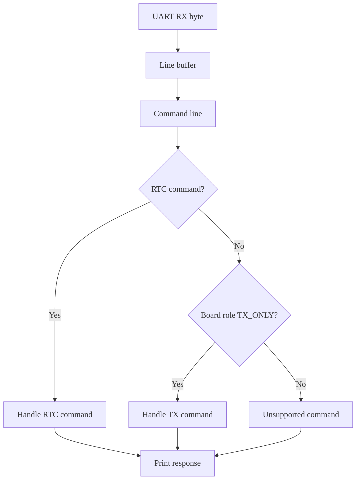

# TX Flow - OWC Project

Tài liệu này mô tả luồng xử lý TX của firmware truyền thông quang không dây OWC trên vi điều khiển STM32F407. Nội dung tập trung vào chế độ `APP_BOARD_ROLE_TX_ONLY`, cơ chế phát dữ liệu OOK bằng timer và cách các lệnh UART điều khiển khối TX trong quá trình chạy runtime.

---

## 1. Tổng quan

Luồng TX trong firmware được chia thành hai phần chính:

1. Khởi tạo hệ thống và bật các ngoại vi phục vụ khối phát.
2. Xử lý theo nhịp ngắt `TIM2` để phát từng bit OOK thông qua `TIM1`.

Các ràng buộc kỹ thuật chính của khối TX:

* `TIM1` tạo sóng mang 1 MHz trên chân `PA8`.
* `TIM2` tạo bit tick 100 kHz.
* Điều chế OOK được thực hiện bằng cách điều khiển `TIM1 CCR1`:

  * Bit `1`: `TIM1 CCR1 = 84`, bật carrier.
  * Bit `0`: `TIM1 CCR1 = 0`, tắt carrier.
* Frame truyền có định dạng:

```text
AA AA AA | D5 | LEN | PAYLOAD | CHECKSUM
```

* Payload mặc định:

```text
55 A5 3C C3
```

* Checksum của payload mặc định là:

```text
FD
```

Nguyên tắc thiết kế quan trọng của firmware là giữ ISR ngắn, không thực hiện UART logging trong ISR và chỉ xử lý các tác vụ thời gian thực tối thiểu trong ngắt `TIM2`.

---

## 2. Các khối chính trong luồng TX

| Khối                    | Vai trò                                               |
| ----------------------- | ----------------------------------------------------- |
| `main.c`                | Gọi khởi tạo hệ thống và duy trì vòng lặp chính       |
| `app_tasks.c/h`         | Điều phối init, start, process và ISR theo board role |
| `vlc_tx.c/h`            | Quản lý frame TX và phát từng bit OOK                 |
| `app_protocol.c/h`      | Tạo frame chuẩn và tính checksum                      |
| `bsp_uart.c/h`          | Nhận lệnh UART và in log                              |
| `bsp_adc_monitor.c/h`   | Giám sát điện áp hệ thống                             |
| `bsp_dac_threshold.c/h` | Thiết lập ngưỡng DAC                                  |
| `bsp_rtc.c/h`           | Quản lý RTC và backup domain                          |

Trong chế độ `APP_BOARD_ROLE_TX_ONLY`, khối TX là thành phần chính được kích hoạt theo chu kỳ bit tick. Các khối còn lại như UART, ADC monitor, DAC threshold và RTC hỗ trợ quá trình debug, giám sát và điều khiển hệ thống.

---

## 3. Luồng khởi động TX

Khi firmware bắt đầu chạy, `main.c` thực hiện các bước khởi tạo HAL, clock hệ thống, GPIO và các ngoại vi cần thiết. Sau đó, `app_tasks_init()` và `app_tasks_start()` được gọi để khởi tạo các module mức ứng dụng và bắt đầu hoạt động theo board role.



**Hình x. Luồng khởi động firmware trong chế độ TX.**

Trong quá trình khởi động, `TIM1` được chuẩn bị để tạo carrier 1 MHz, trong khi `TIM2` được dùng làm nguồn bit tick 100 kHz. Sau khi các module ứng dụng được khởi tạo, firmware bắt đầu vòng lặp chính để xử lý UART command, log định kỳ và các tác vụ nền.

---

## 4. Luồng phát bit TX

Mỗi khi `TIM2` phát sinh ngắt, firmware gọi callback xử lý timer. Trong chế độ `APP_BOARD_ROLE_TX_ONLY`, ISR chỉ gọi hàm `vlc_tx_on_bit_tick()` để phát một bit dữ liệu.



**Hình x. Lưu đồ phát bit OOK trong mỗi chu kỳ ngắt TIM2.**

Trong mỗi bit tick, firmware kiểm tra trạng thái `carrier_test`. Nếu chế độ test carrier đang bật, firmware giữ `CCR1 = 84` để tạo carrier liên tục. Nếu không ở chế độ test, firmware kiểm tra trạng thái phát dữ liệu. Khi TX được kích hoạt, bit kế tiếp trong frame được đọc theo thứ tự MSB-first. Với bit `1`, firmware ghi `CCR1 = 84` để bật carrier. Với bit `0`, firmware ghi `CCR1 = 0` để tắt carrier.

---

## 5. Cấu trúc frame TX

Frame TX được xây dựng theo định dạng thống nhất giữa TX và RX:

```text
AA AA AA | D5 | LEN | PAYLOAD | CHECKSUM
```

Trong đó:

| Trường     | Ý nghĩa                                               |
| ---------- | ----------------------------------------------------- |
| `AA AA AA` | Preamble, dùng để phía thu phát hiện và đồng bộ frame |
| `D5`       | Sync byte, đánh dấu bắt đầu phần dữ liệu thực         |
| `LEN`      | Độ dài payload                                        |
| `PAYLOAD`  | Dữ liệu cần truyền                                    |
| `CHECKSUM` | Byte kiểm tra lỗi                                     |



**Hình x. Cấu trúc frame truyền của khối TX.**

Checksum được tính theo công thức:

```text
CHECKSUM = (LEN + sum(PAYLOAD)) mod 256
```

Với payload mặc định:

```text
LEN = 04
PAYLOAD = 55 A5 3C C3
```

Checksum được tính như sau:

```text
CHECKSUM = (04 + 55 + A5 + 3C + C3) mod 256
CHECKSUM = FD
```

Do đó frame mặc định hoàn chỉnh là:

```text
AA AA AA D5 04 55 A5 3C C3 FD
```

---

## 6. Luồng build frame TX

Khi khởi tạo TX, module `vlc_tx` lấy payload mặc định từ `app_protocol_get_expected_payload()`, sau đó gọi `app_protocol_build_frame()` để tạo frame truyền hoàn chỉnh.



**Hình x. Sequence chart quá trình tạo frame TX khi khởi tạo.**

Việc tách phần build frame sang module `app_protocol` giúp TX và RX dùng chung một định dạng frame và cùng một thuật toán checksum. Cách tổ chức này hạn chế lỗi không đồng bộ giữa phía phát và phía thu.

---

## 7. Luồng UART điều khiển TX

UART command được xử lý trong foreground loop tại `app_tasks_process()`. Firmware không xử lý UART trong ISR nhằm tránh blocking và đảm bảo ngắt `TIM2` luôn đủ ngắn để đáp ứng bit rate 100 kHz.



**Hình x. Luồng xử lý UART command trong foreground loop.**

Các command TX chính được hỗ trợ trong chế độ `APP_BOARD_ROLE_TX_ONLY` gồm:

| Command                  | Chức năng                                 |
| ------------------------ | ----------------------------------------- |
| `tx_payload <hex bytes>` | Cập nhật payload và build lại frame TX    |
| `tx_start`               | Bật chế độ phát liên tục                  |
| `tx_stop`                | Dừng phát dữ liệu                         |
| `tx_carrier_on`          | Bật carrier liên tục để đo kiểm phần cứng |
| `tx_carrier_off`         | Tắt chế độ carrier test                   |
| `tx_single`              | Phát một frame đơn                        |
| `tx_status`              | In trạng thái TX hiện tại                 |

---

## 8. Chi tiết các lệnh UART điều khiển TX

### 8.1. Lệnh `tx_payload`

Lệnh:

```text
tx_payload 11 22 33 44 55 66 77 88
```

Luồng xử lý:

1. Tách từng token hex sau chuỗi `tx_payload`.
2. Parse từng byte bằng `strtoul(..., 16)`.
3. Kiểm tra giá trị sau khi parse không vượt quá `0xFF`.
4. Kiểm tra số byte không vượt quá `APP_MAX_PAYLOAD_LEN`.
5. Gọi `vlc_tx_set_payload(payload, len)` để cập nhật frame TX.
6. Trả về kết quả:

```text
cmd_ok tx_payload len=8 checksum=04
```

Lệnh này cho phép thay đổi dữ liệu phát trong quá trình runtime mà không cần build lại firmware.

### 8.2. Lệnh `tx_start`

Lệnh `tx_start` bật chế độ phát liên tục. Sau khi command được xử lý thành công, TX sẽ phát lặp lại frame hiện tại theo bit tick của `TIM2`.

Phản hồi:

```text
cmd_ok tx_start
```

### 8.3. Lệnh `tx_stop`

Lệnh `tx_stop` dừng phát dữ liệu. Sau khi dừng, carrier được kéo về trạng thái tắt bằng cách ghi `CCR1 = 0`.

Phản hồi:

```text
cmd_ok tx_stop
```

### 8.4. Lệnh `tx_carrier_on`

Lệnh `tx_carrier_on` bật chế độ carrier test. Trong chế độ này, firmware giữ `CCR1 = 84` để tạo carrier liên tục trên chân `PA8`. Lệnh này thường được dùng khi đo tần số carrier bằng oscilloscope.

Phản hồi:

```text
cmd_ok tx_carrier_on
```

### 8.5. Lệnh `tx_carrier_off`

Lệnh `tx_carrier_off` tắt chế độ carrier test.

Phản hồi:

```text
cmd_ok tx_carrier_off
```

### 8.6. Lệnh `tx_single`

Lệnh `tx_single` cho phép phát đúng một frame rồi tự dừng. Chế độ này phù hợp để kiểm tra dạng sóng frame trên oscilloscope hoặc debug quá trình nhận frame ở phía RX.

Phản hồi:

```text
cmd_ok tx_single
```

### 8.7. Lệnh `tx_status`

Lệnh `tx_status` in snapshot trạng thái TX hiện tại.

Dạng log:

```text
tx_status tx_enabled=<0|1> carrier_test=<0|1> tx_frames=<N> tx_frame_id=<N> bit_rate=100000 len=<N> payload=<HEX...> checksum=<XX> frame=<HEX...>
```

Log này giúp kiểm tra trạng thái bật/tắt TX, chế độ carrier test, số frame đã phát và nội dung frame hiện tại.

---

## 9. Cập nhật frame runtime an toàn

Khi payload được thay đổi bằng UART command, firmware không ghi trực tiếp lên buffer TX trong khi ISR có thể đang đọc dữ liệu. Để tránh tình trạng ISR đọc frame ở trạng thái chưa cập nhật hoàn chỉnh, firmware sử dụng cơ chế cập nhật an toàn như sau:

1. Build frame mới vào buffer tạm.
2. Vào critical section ngắn bằng `__disable_irq()`.
3. Copy frame mới vào buffer TX.
4. Reset chỉ số bit về đầu frame.
5. Thoát critical section bằng `__enable_irq()`.

Minh họa:

```text
Build frame mới vào buffer tạm
        ↓
__disable_irq()
        ↓
Copy frame mới vào buffer TX
        ↓
Reset bit index
        ↓
__enable_irq()
```

Mục tiêu của cách làm này là đảm bảo tính nhất quán của frame TX, đồng thời giữ thời gian khóa ngắt ngắn để không ảnh hưởng đến yêu cầu realtime của hệ thống.

---

## 10. Log TX qua UART

Các dòng log chính của TX gồm:

```text
role board_role=TX_ONLY
alive_tx tx_frames=<N> tx_frame_id=<N> bit_rate=100000 tx_enabled=<0|1> carrier_test=<0|1>
tx_frame tx_frame_id=<N> len=<N> payload=<HEX...> checksum=<XX> frame=<FULL_FRAME_HEX...>
adc_mv ...
dac_mv threshold=1650
rtc ...
```

Ý nghĩa các log:

| Log                       | Ý nghĩa                                   |
| ------------------------- | ----------------------------------------- |
| `role board_role=TX_ONLY` | Firmware đang chạy ở chế độ chỉ phát      |
| `alive_tx ...`            | Heartbeat định kỳ của TX                  |
| `tx_frame ...`            | Snapshot frame TX hiện tại                |
| `adc_mv ...`              | Giá trị điện áp hệ thống đã scale theo mV |
| `dac_mv threshold=1650`   | Ngưỡng DAC hiện tại                       |
| `rtc ...`                 | Thời gian RTC hiện tại                    |

Log được thiết kế theo dạng key-value để dễ đọc bằng terminal và dễ parse bằng GUI. Ví dụ:

```text
alive_tx tx_frames=120 tx_frame_id=120 bit_rate=100000 tx_enabled=1 carrier_test=0
```

---

## 11. Trạng thái runtime của TX

TX không sử dụng FSM phức tạp như RX, nhưng vẫn có các trạng thái runtime quan trọng:

| Trạng thái              | Mô tả                           |
| ----------------------- | ------------------------------- |
| `tx_enabled = 1`        | Phát liên tục frame hiện tại    |
| `tx_enabled = 0`        | Không phát dữ liệu, carrier tắt |
| `carrier_test = 1`      | Giữ carrier bật liên tục        |
| `single_frame_mode = 1` | Phát một frame rồi tự dừng      |

Các trạng thái này giúp firmware hỗ trợ nhiều kịch bản kiểm thử khác nhau, từ đo carrier cố định đến phát frame liên tục hoặc phát một frame đơn lẻ.

---

## 12. Luồng kiểm thử TX_ONLY

Khi kiểm thử chế độ `APP_BOARD_ROLE_TX_ONLY`, cần quan sát các tiêu chí sau:

1. `tx_frames` tăng đều theo thời gian khi TX được bật.
2. `tx_frame` hiển thị đúng payload mặc định hoặc payload vừa được cập nhật.
3. Command `tx_payload` phản hồi đúng độ dài và checksum.
4. Trên oscilloscope:

   * Có carrier 1 MHz trên chân `PA8`.
   * Dạng sóng OOK bật/tắt đúng theo bit `1` và `0`.
5. Khi dùng `tx_stop`, carrier phải tắt.
6. Khi dùng `tx_carrier_on`, carrier phải bật liên tục.
7. Không có thao tác UART logging bên trong ISR.

Bảng tiêu chí kiểm thử:

| Nội dung kiểm thử | Kết quả mong muốn                             |
| ----------------- | --------------------------------------------- |
| Carrier test      | PA8 xuất carrier 1 MHz                        |
| `tx_start`        | Frame được phát liên tục                      |
| `tx_stop`         | Carrier bị tắt                                |
| `tx_single`       | Chỉ phát một frame                            |
| `tx_payload`      | Frame được build lại đúng payload và checksum |
| UART log          | Log đúng format key-value                     |
| ISR               | Không bị kéo dài bởi UART logging             |

---

## 13. Kết luận

Luồng TX của OWC Project được thiết kế theo hướng tách biệt rõ ràng giữa khối phát thời gian thực và khối điều khiển nền. `TIM1` đảm nhiệm tạo carrier 1 MHz, trong khi `TIM2` cung cấp bit tick 100 kHz để phát từng bit OOK. Việc điều chế được thực hiện bằng cách thay đổi giá trị `TIM1 CCR1`, giúp bật hoặc tắt carrier tương ứng với bit dữ liệu.

Frame TX được build theo giao thức thống nhất trong `app_protocol`, bảo đảm định dạng dữ liệu giữa TX và RX là đồng nhất. Các command UART như `tx_payload`, `tx_start`, `tx_stop`, `tx_carrier_on`, `tx_carrier_off`, `tx_single` và `tx_status` được xử lý trong foreground loop, không xử lý trong ISR. Khi cập nhật payload runtime, firmware sử dụng critical section ngắn để tránh lỗi đọc/ghi đồng thời giữa main loop và ISR.

Nhìn chung, thiết kế TX đáp ứng các yêu cầu chính của hệ thống truyền thông quang OOK: duy trì timing ổn định, giữ ISR ngắn, hỗ trợ điều khiển runtime qua UART và cho phép debug dễ dàng bằng log cũng như oscilloscope.
