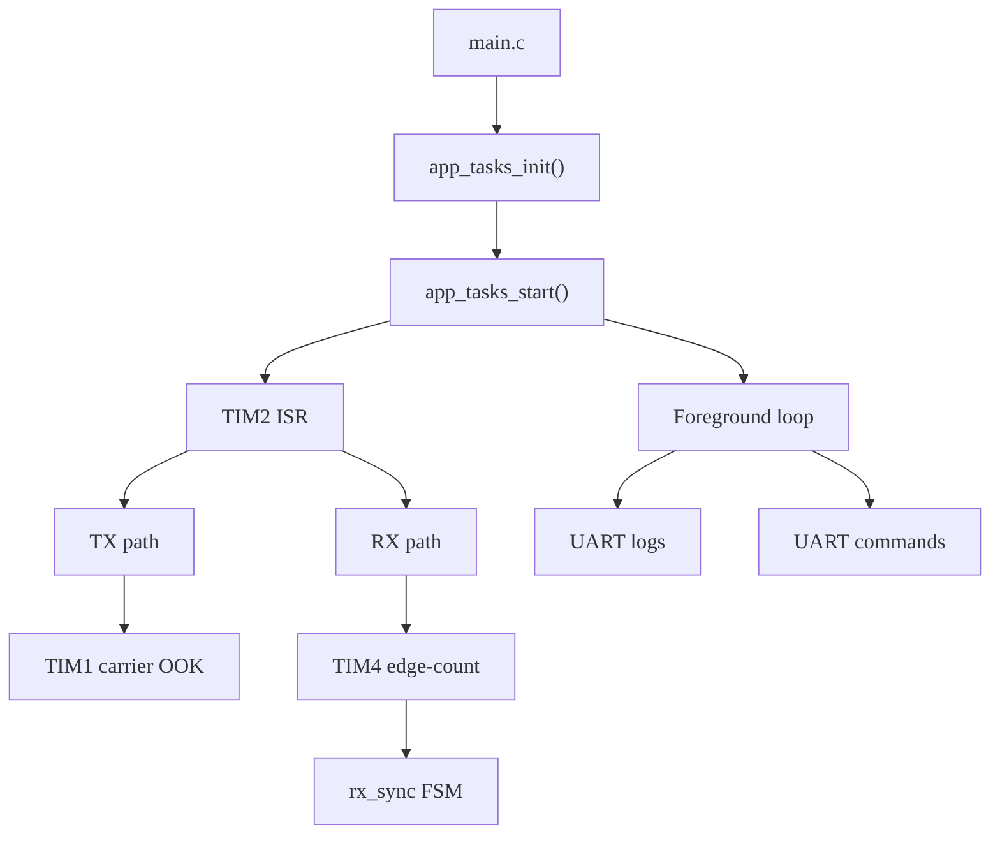
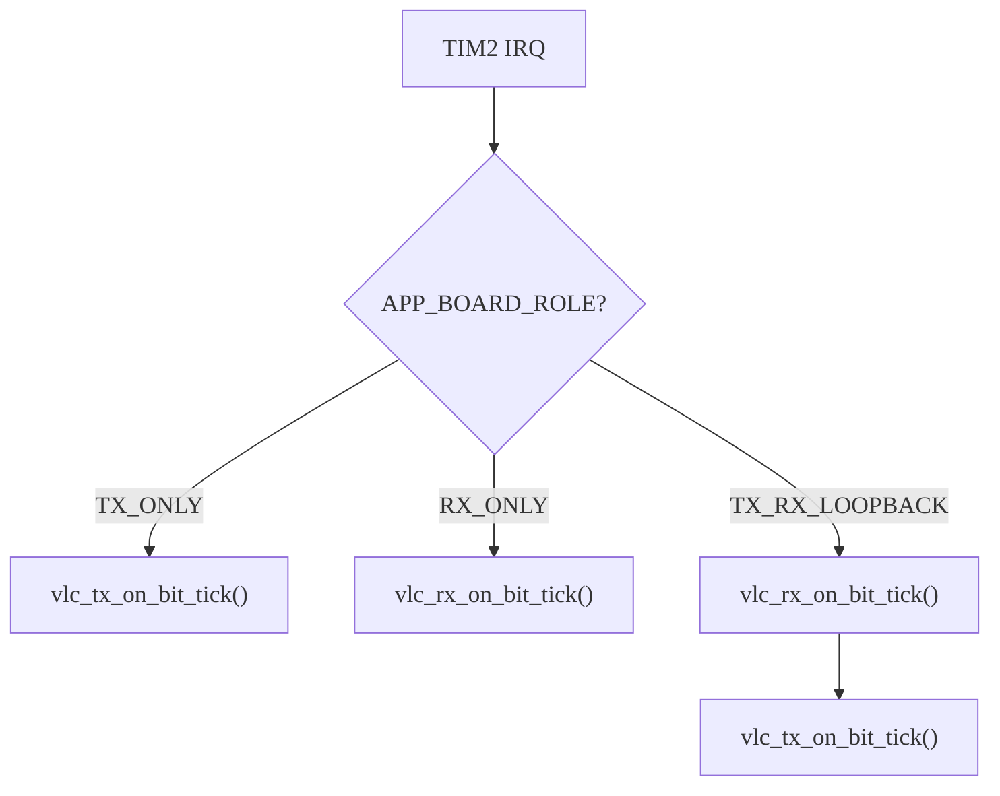
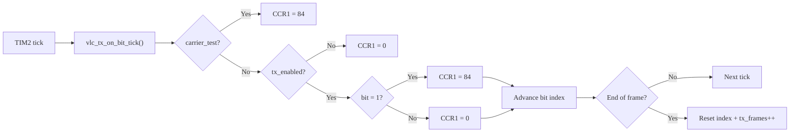
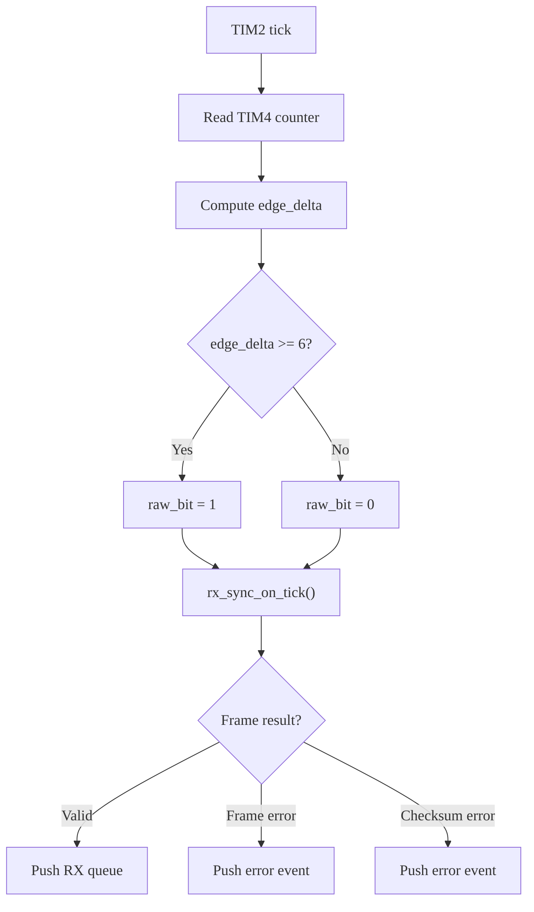
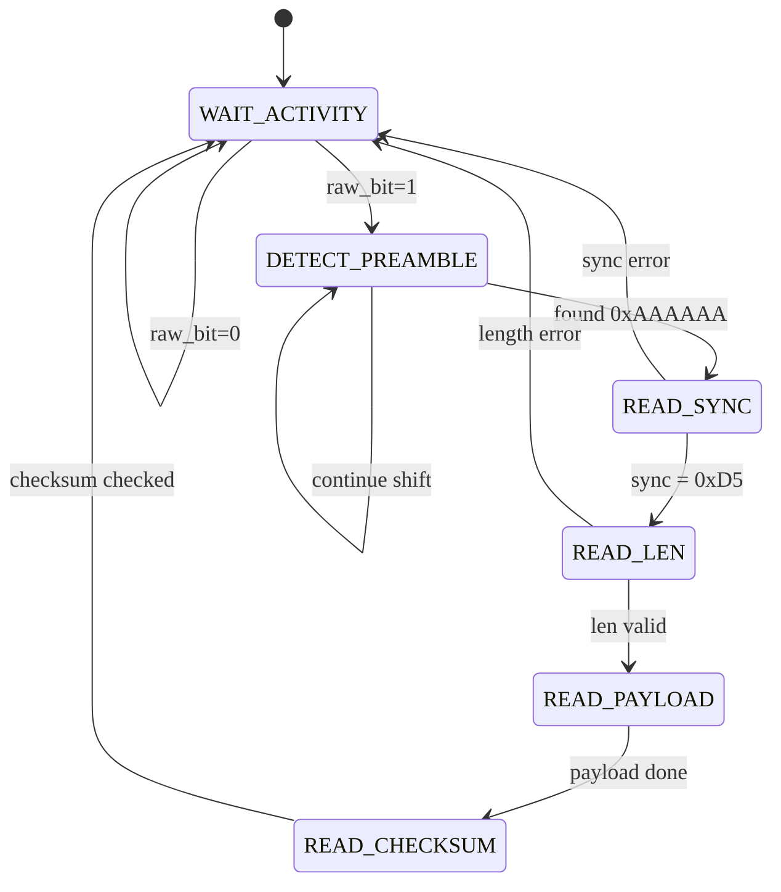
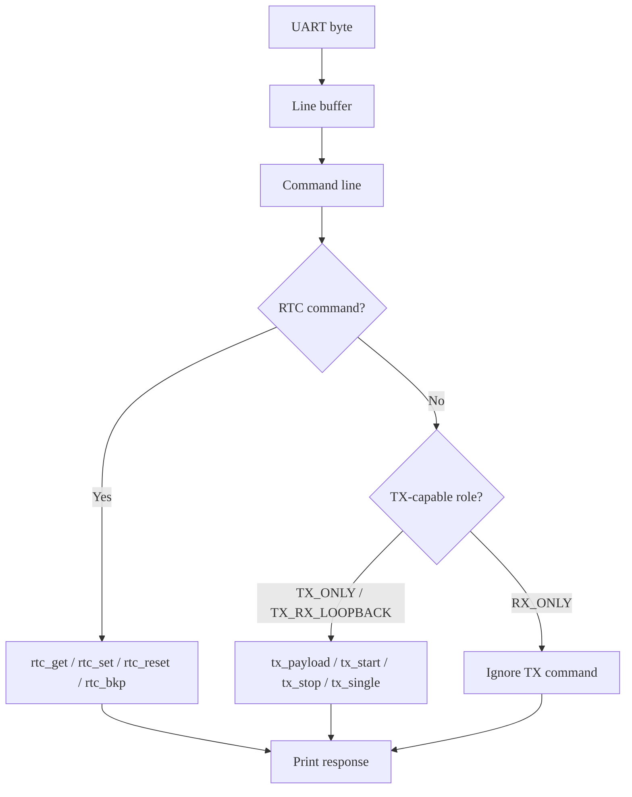
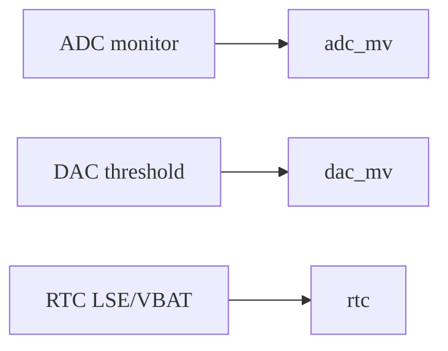

# Overview Firmware OWC Project

Tài liệu này tóm tắt các phần quan trọng nhất của firmware OWC để dùng cho slide overview. Nội dung tập trung vào kiến trúc tổng quan, luồng TX/RX, FSM RX, giao tiếp UART, và các khối giám sát hệ thống.

---

## 1. Tổng quan kiến trúc firmware

Firmware được xây dựng trên STM32F407 và chia thành các khối chính:

- `main.c`: khởi tạo hệ thống và chạy vòng lặp chính.
- `app_tasks.c`: điều phối init, start, ISR dispatch, xử lý UART và log foreground.
- `vlc_tx.c`: phát frame OOK theo bit tick.
- `vlc_rx.c`: đọc edge-count TIM4, tạo raw bit và đẩy vào FSM RX.
- `rx_sync.c`: giải mã frame theo FSM.
- `app_protocol.c`: build frame và checksum dùng chung cho TX/RX.
- `bsp_uart.c`, `bsp_adc_monitor.c`, `bsp_dac_threshold.c`, `bsp_rtc.c`: dịch vụ nền.



---

## 2. Cơ chế board role

Firmware hỗ trợ 3 chế độ biên dịch:

- `APP_BOARD_ROLE_TX_ONLY`
- `APP_BOARD_ROLE_RX_ONLY`
- `APP_BOARD_ROLE_TX_RX_LOOPBACK`



Ý nghĩa:

- `TX_ONLY`: chỉ phát, không chạy RX FSM trong ISR.
- `RX_ONLY`: chỉ thu, không phát bit trong ISR.
- `TX_RX_LOOPBACK`: chạy cả RX và TX, dùng cho kiểm thử nội bộ.

---

## 3. Flow phát TX

TX dùng điều chế OOK:

- bit `1` -> `TIM1 CCR1 = 84`
- bit `0` -> `TIM1 CCR1 = 0`

Frame TX:

```text
AA AA AA | D5 | LEN | PAYLOAD | CHECKSUM
```



---

## 4. Flow thu RX

RX dùng TIM4 đếm cạnh trên PB6.

Mỗi `TIM2` tick:

1. Đọc counter TIM4.
2. Tính `edge_delta`.
3. So sánh với `APP_RX_EDGE_THRESHOLD = 6`.
4. Tạo `raw_bit`.
5. Đẩy vào `rx_sync_on_tick()`.



---

## 5. FSM đồng bộ RX

FSM RX là phần quan trọng nhất của khối thu.

Các state:

- `RX_SYNC_WAIT_ACTIVITY`
- `RX_SYNC_DETECT_PREAMBLE`
- `RX_SYNC_LOCK_BIT_TIMING`
- `RX_SYNC_READ_SYNC`
- `RX_SYNC_READ_LEN`
- `RX_SYNC_READ_PAYLOAD`
- `RX_SYNC_READ_CHECKSUM`



Checksum:

```text
CHECKSUM = (LEN + sum(PAYLOAD)) mod 256
```

Frame hợp lệ được đẩy vào queue để foreground loop log ra `last_rx`, `rx_frame`, `link_stats`, `link_quality`.

---

## 6. UART log và command

Firmware không in log trong ISR. Tất cả log và command được xử lý ở foreground loop.



Nhóm lệnh TX được hỗ trợ trong cả `APP_BOARD_ROLE_TX_ONLY` và
`APP_BOARD_ROLE_TX_RX_LOOPBACK`. Riêng `APP_BOARD_ROLE_RX_ONLY` không có khối
phát nên firmware bỏ qua các lệnh TX và trả response lỗi command không hỗ trợ.

Các log chính:

- `role ...`
- `alive_tx ...` hoặc `alive_rx ...`
- `tx_frame ...`
- `expected_tx_frame ...`
- `last_rx ...`
- `rx_frame ...`
- `link_stats ...`
- `link_quality ...`
- `err_summary ...`
- `adc_mv ...`
- `dac_mv ...`
- `rtc ...`

---

## 7. Khối giám sát hệ thống

Hai khối nền giúp theo dõi trạng thái board:

- ADC monitor:
  - `rx_out_a`
  - `vmon_bu`
  - `vmon_bu_3v`
  - `vmon_main_sys`
  - `vmon_main`
  - `vmon_5v_sys`
  - `vmon_3v3_sys`
- DAC threshold:
  - mặc định `1650 mV`
- RTC:
  - dùng LSE `32.768 kHz`
  - backup register để giữ trạng thái thời gian khi VBAT còn



---

## 8. Điểm nhấn để đưa vào slide

Nếu chỉ chọn phần quan trọng nhất cho slide overview, nên ưu tiên:

1. Kiến trúc firmware.
2. Cơ chế board role.
3. Flow TX OOK.
4. Flow RX edge-count.
5. FSM RX.
6. UART log và command.

Đây là các phần thể hiện rõ nhất cách firmware vận hành và đủ để người xem hiểu hệ thống ngay từ cái nhìn đầu.
